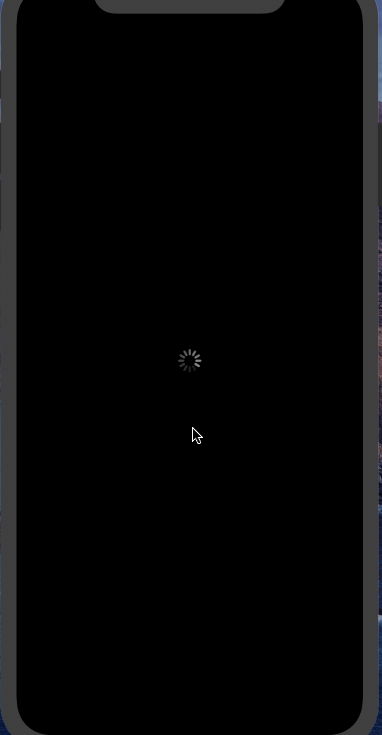

# Flix

Flix is an iOS app that allows users to browse movies from the [The Movie Database API](http://docs.themoviedb.apiary.io/#).

---
## Flix Part 2

### User Stories

#### REQUIRED (10pts)
- [x] (5pts) User can tap a cell to see more details about a particular movie.
- [x] (5pts) User can tap a tab bar button to view a grid layout of Movie Posters using a CollectionView.

### App Walkthough GIF
 

--

## Flix Part 1

### User Stories

#### REQUIRED (10pts)
- [x] (2pts) User sees an app icon on the home screen and a styled launch screen.
- [x] (5pts) User can view and scroll through a list of movies now playing in theaters.
- [x] (3pts) User can view the movie poster image for each movie.

### App Walkthough GIF

GIF created with [LiceCap](http://www.cockos.com/licecap/).
